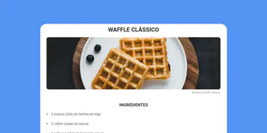

 

  <h1 align="center">Desafio Página de Receita</h1>
  

  
Desafio Página de Receita presente no Discover  <a href="https://www.rocketseat.com.br/" target="_blank"> Rocketseat</a>

   
  
Nesse desafio você deverá criar uma página web de uma receita com título, imagem, lista de ingredientes e modo de preparo. O desafio está dividido em duas partes, no primeiro momento você irá criar a estrutura HTML com as informações da receita e na segunda parte será o momento de adicionar os estilos à página com o CSS. 
   
   
Saiba mais sobre esse desafio clicando <a href="https://app.rocketseat.com.br/discover/challenges/cookbook">aqui</a>

  
 

 
 

# 🚀 Tecnologias

 

# 🔎 Confira

  <image src="./github/1.png" width="500px">  
  <image src="./github/2.png" width="300px">

